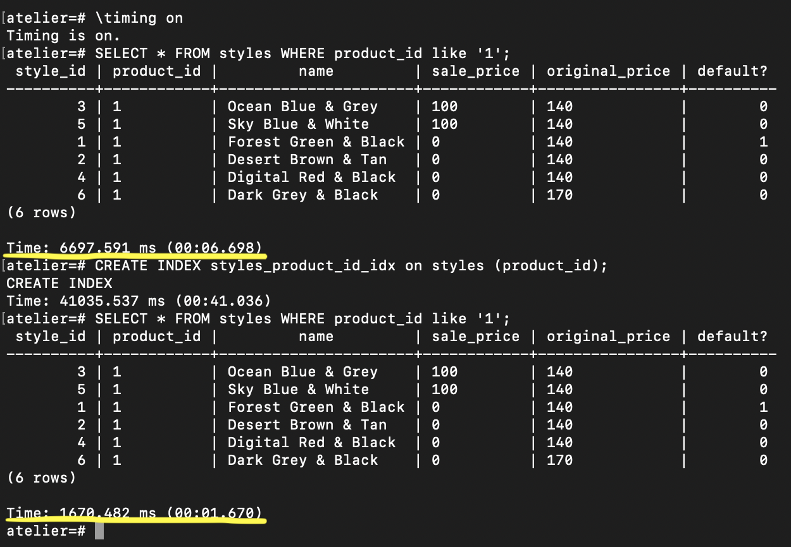
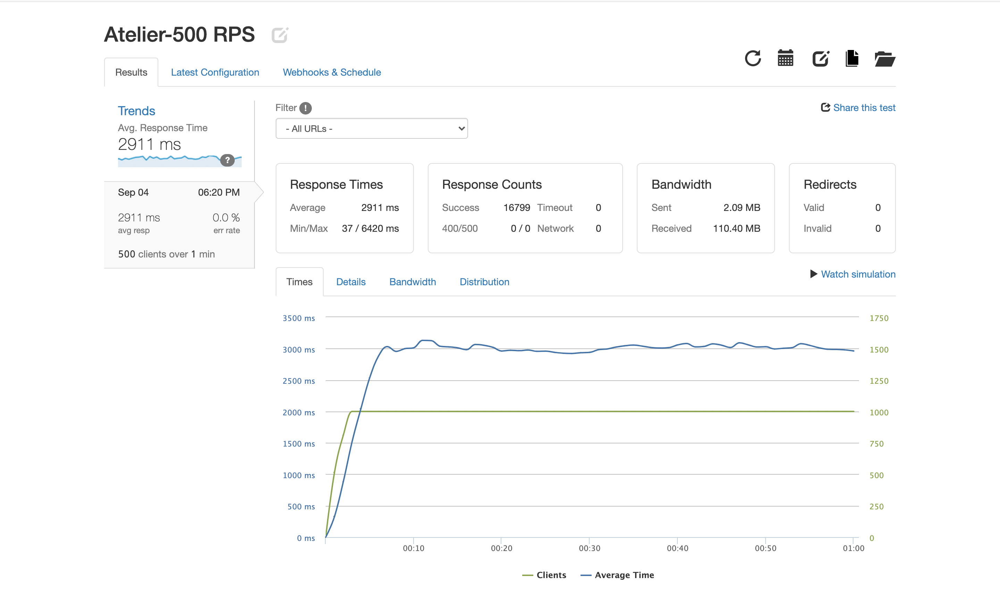
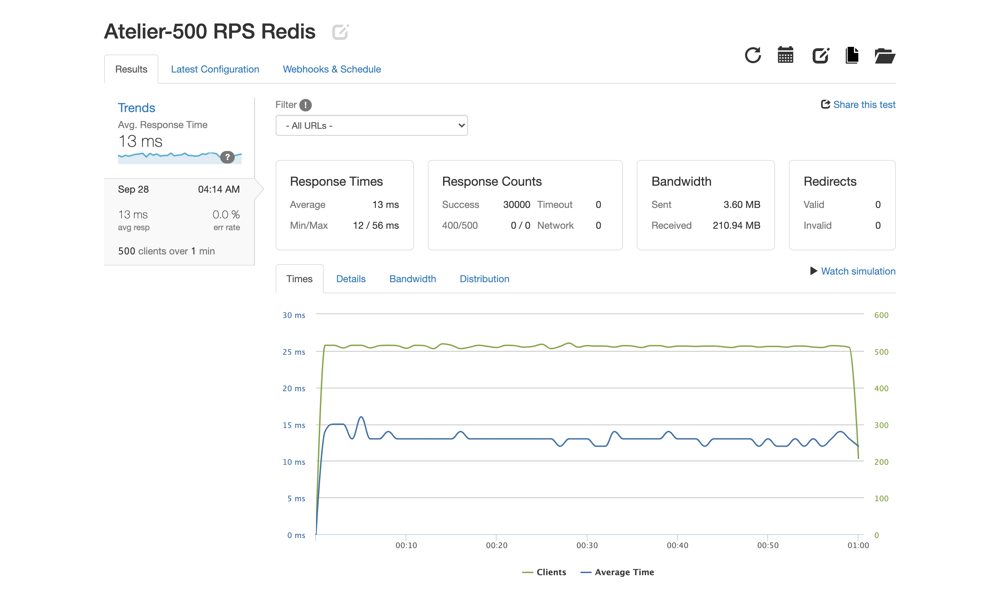
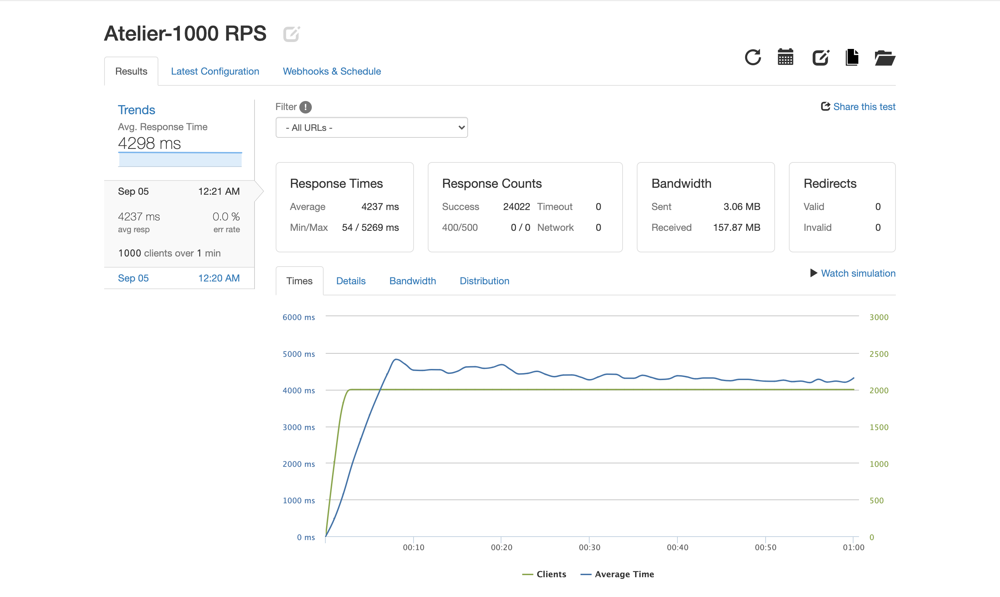
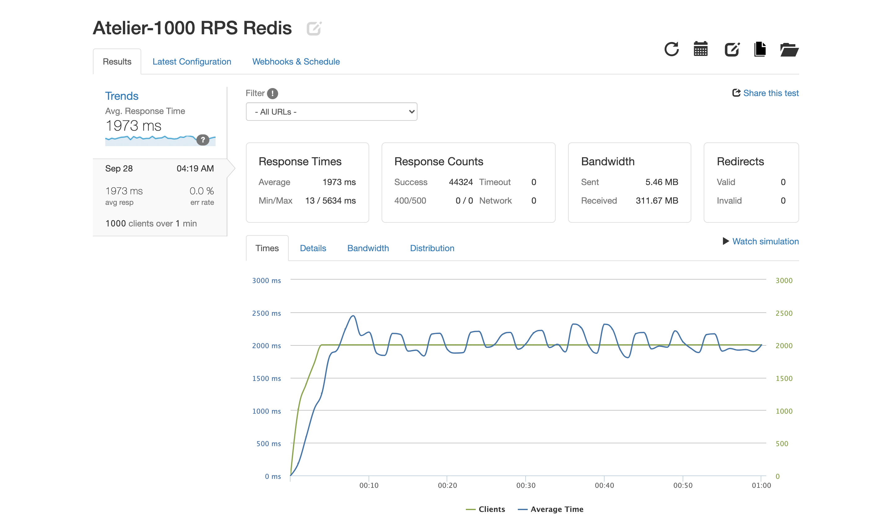

# Atelier Products API

## About
The goal of this project was to build a scalable RESTful API service for the Products component of an e-commerce website. The service was optimized by leveraging database indexing, connection pooling, and Redis caching. The server and Postgres database were containerized with Docker and scaled using Docker Swarm. 

## Development
1. Clone this repo https://github.com/sdc-cirrus/products-api.git
2. Install [Docker](https://www.docker.com/products/docker-desktop)
3. Create a .env file in the project's root directory and provide POSTGRES_USER, POSTGRES_PASSWORD, POSTGRES_DB, POSTGRES_HOST and POSTGRES_PORT.
4. In the project's root directory, run:
```
docker-compose up
```
## Tech Stack
- [Docker](https://www.docker.com/)
- [PostgreSQL](https://www.postgresql.org/)
- [Redis](https://redis.io/)
- [Node-PG](https://node-postgres.com/)
- [Artillery](https://artillery.io/)
- [LoaderIO](https://loader.io/)

## ETL
1. Inherited legacy dataset consisting of 40M records.
2. Used Node streams to transform data.
3. Designed appropriate schemas for the data
4. Leveraged Node-PG connection pools and DBeaver to load the data into the local development database and deployed database.
5. Incorporated Docker Swarm to replicate multiple instances of the server and scale the API

## Testing
Used Loader.IO and Artillery to stress test the API. 

## Routes

| HTTP METHOD  | Endpoint                    | Returns                                                                    | Status |
|--------------|-----------------------------|----------------------------------------------------------------------------|--------|
| GET          | /products/:productId/related| Returns the IDs of products related to the specified product               | 200    |
| GET          | /products/:productId/styles | Returns the all styles available for the given product                     | 200    |
| GET          | /products/:productId        | Returns all product level information for a specified product id           | 200    |
| GET          | /products/list              | Retrieves the list of products                                             | 200    |

## Results
<details>
  <summary>Indexing</summary>


</details>
<details>
  <summary>Scenario 1</summary>
<br>500 Requests Per Second for 1 Minute
<br>GET /products/6/styles

#### No Redis Caching


#### With Redis Caching

</details>

<details>
  <summary>Scenario 2</summary>
<br>1000 Requests Per Second for 1 Minute
<br>GET /products/6/styles

#### No Redis Caching


#### With Redis Caching

</details>

